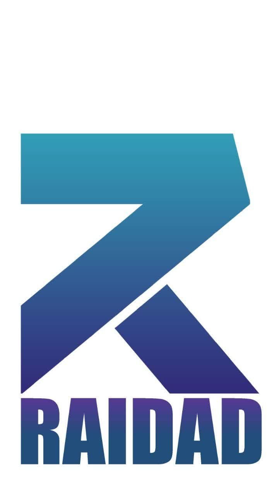

# 

# RAIDAD  

**RAIDAD: A Model-Driven Framework for Automated and Agile Development of IoT Data Analysis Software**  

RAIDAD is a Model-Driven Software Engineering (MDSE) tool designed for the automated and agile development of data analysis software in the Internet of Things (IoT) domain. This tool is built based on the CRISP-DM standard and supports various stages of the data analysis lifecycle.  

RAIDAD is a model-driven framework designed to streamline the development of IoT data analysis applications. The name "RAIDAD" draws inspiration from "RAID," symbolizing speed, coordination, and safety in data management, while its acronym highlights the framework's core principles: **Rapid Analysis**, **Adaptive Integration**, **Intelligent Design**, and **Data-Aware**.

## Why RAIDAD?  

The development of data analysis software for IoT applications is often a complex, time-consuming process, requiring expertise in programming, statistics, and data management. Existing model-driven approaches fall short in comprehensively addressing the full lifecycle of data analysis as outlined in the CRISP-DM methodology. Moreover, they do not establish a direct and continuous relationship between data and models throughout the modeling process.  

**RAIDAD** bridges this gap by offering a comprehensive, model-driven framework tailored for IoT data analysis. Unlike traditional model-driven tools, RAIDAD incorporates the following unique features:  

- **Domain-Specific Modeling Language (DSML):** Designed specifically to represent IoT data analysis workflows, enabling developers to abstract away low-level complexities while focusing on domain-specific tasks.  
- **Data Model Assistant (DMA):** Realizes data-aware model-driven engineering for data analysis software development by introducing a DMA module, ensuring seamless integration into the modeling process with real-time insights and adjustments.  
- **Automation-Driven Code Generation:** Automatically generates Python code for data analysis pipelines, from preprocessing to model evaluation, reducing development time significantly.  
- **Flexibility and Scalability:** Supports advanced machine learning and data analytics techniques, allowing for integration with popular libraries like Scikit-Learn, Keras, and PyClustering.  

RAIDAD stands out by unifying data-driven and model-driven paradigms. It ensures that developers can efficiently create, evaluate, and refine IoT data analysis applications without being overwhelmed by repetitive tasks or the need for extensive domain knowledge.  
