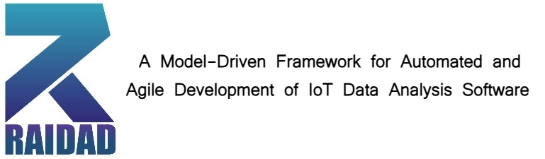

# 

# RAIDAD  

**RAIDAD: A Model-Driven Framework for Automated and Agile Development of IoT Data Analysis Software**  

RAIDAD is a Model-Driven Software Engineering (MDSE) tool designed for the automated and agile development of data analysis software in the Internet of Things (IoT) domain. This tool is built based on the CRISP-DM standard and supports various stages of the data analysis lifecycle.  

RAIDAD is a model-driven framework designed to streamline the development of IoT data analysis applications. The name 'RAIDAD' represents the framework's core principles: **Rapid**, **Adaptive**, **Intelligent**, and **Data-Aware development**, aimed at optimizing the data analysis process for IoT systems.

## Why RAIDAD?  

The development of data analysis software for IoT applications is often a complex, time-consuming process, requiring expertise in programming, statistics, and data management. Existing model-driven approaches fall short in comprehensively addressing the full lifecycle of data analysis as outlined in the CRISP-DM methodology. Moreover, they do not establish a direct and continuous relationship between data and models throughout the modeling process.  

**RAIDAD** bridges this gap by offering a comprehensive, model-driven framework tailored for IoT data analysis. Unlike traditional model-driven tools, RAIDAD incorporates the following unique features:  

- **Domain-Specific Modeling Language (DSML):** Designed specifically to represent IoT data analysis workflows, enabling developers to abstract away low-level complexities while focusing on domain-specific tasks.  
- **Data Model Assistant (DMA):** Realizes data-aware model-driven engineering for data analysis software development by introducing a DMA module, ensuring seamless integration into the modeling process with real-time insights and adjustments.  
- **Automation-Driven Code Generation:** Automatically generates Python code for data analysis pipelines, from preprocessing to model evaluation, reducing development time significantly.  
- **Flexibility and Scalability:** Supports advanced machine learning and data analytics techniques, allowing for integration with popular libraries like Scikit-Learn, Keras, and PyClustering.  

RAIDAD stands out by unifying data-driven and model-driven paradigms. It ensures that developers can efficiently create, evaluate, and refine IoT data analysis applications without being overwhelmed by repetitive tasks or the need for extensive domain knowledge.  

# Table of Contents
- [Introducing RAIDAD](#introducing-raidad)
- [Reporting Issues/Bugs and Requests](#reporting-issuesbugs-and-requests)
- [RAIDAD Feature Model](#RAIDAD-Feature-Model)
- [Supported Techniques and Algorithms](#supported-techniques-and-algorithms)
- [RAIDAD Quick Start Tutorial (10 Minutes)](#raidad-quick-start-tutorial-10-minutes)
- [Users' Documentation (Full Tutorial)](#users-documentation-full-tutorial)
   - [Introduction](#introduction)
   - [Basic Usage](#basic-usage)
   - [Automated Troubleshooting](#automated-troubleshooting)
   - [Message Types](#message-types)
   - [Data Analysis Pipeline](#data-analysis-pipeline)
   - [Code Generation](#code-generation)
- [Developer Tips and Best Practices](#developer-tips-and-best-practices)
- [Participant Assessment Documents](#participant-assessment-documents)

## Introducing RAIDAD
RAIDAD is a framework powered by Model-Driven Software Engineering. We **recommend** that you **watch the introductory video about RAIDAD on our YouTube channel before getting started**. The video is about **2 minutes** long.

[Back to top](#table-of-contents)

## Reporting Issues/Bugs and Requests

RAIDAD is an open-source research project, and we highly appreciate your feedback. If you encounter any issues, bugs, or have any requests, please report them to us through our issue tracking system: [https://github.com/Mohsengholami2008/RAIDAD/issues](https://github.com/Mohsengholami2008/RAIDAD/issues). 

We value these reports as they are essential for improving RAIDAD. Thank you for helping us enhance the project.

[Back to top](#table-of-contents)

## RAIDAD Feature Model
A widely used approach for domain analysis is the feature model. We utilized the Feature-Oriented Domain Analysis (FODA) method. For feature extraction from various software, libraries, papers, and articles, we used tools such as RapidMiner, SPSS Modeler, Weka, Orange, Keras, Scikit-learn, PyClustering, AutoClien, CRISP-DM, AutoPrep, and ML-Quadrat. Ultimately, the RAIDAD feature model is illustrated in Figure 1.

<em>Figure 1. RAIDAD Feature Model.</em>

[Back to top](#table-of-contents)

## Supported Techniques and Algorithms

RAIDAD not only performs a wide range of data- and model-based analyses in real-time during the modeling process but also leverages libraries such as Keras, scikit-learn, and PyClustering for code generation. The following techniques and algorithms are currently supported by RAIDAD:

- **Data Understanding:**
  - Visualization
  - Statistics
  - Correlation
  - Standard Deviation
  - Outlayer

- **Data Preprocessing:**
  - **Simple Imputation:**
    - Median Imputation
    - Mean Imputation
    - Robust Scaling
    - Manual Filling
  - **k-Nearest Neighbors (kNN) Imputation**
  - **Scaling:**
    - Normalization
    - Standardization
    - Robust Scaling
  - **Encoding:**
    - OneHot
  - **Duplicate**
  - **Transformation**
  - **Dimentialy Reduction**
    - Principal component analysis (PCA)
  - **Auto Preprocess**

- **Machine Learning Algorithms:**
  - **Classification:**
    - **Ensembling:**
      - Voting (Hard & Soft)
      - Random Forest
    - k-Nearest Neighbors (kNN)
    - Support Vector Machines (SVM)
    - Multi-Layer Perceptron (MLP)
    - Linear Regression
  - **Clustering:**
    - DBSCAN
    - OPTICS
    - k-Median
    - k-Means
- **Evaluation:**
  - Clustering Evaluation
  - Classification Evaluation
  - Evaluation Visualization

These techniques and algorithms are integrated into the RAIDAD framework to facilitate efficient and robust data analysis.

[Back to top](#table-of-contents)

## RAIDAD Quick Start Tutorial (10 Minutes)
A 10-minute video tutorial on how to work with the RAIDAD framework is available on our YouTube channel. You can watch it here: [Watch the video](https://www.youtube.com/******).

[Back to top](#table-of-contents)

## Users' Documentation (Full Tutorial)

### Introduction

RAIDAD leverages a user-friendly graphical editor powered by Sirius to facilitate modeling. It is structured around three core components:  

1. **Toolbox**:  
   The toolbox provides essential language elements aligned with the designed metamodel, encompassing:  
   - **Process Design**: Enables the creation of the data analysis process and flow for software.  
   - **Tools**: Defines relationships between concepts in the model and their execution sequence.  
   - **Import Data**: Offers tools to load various dataset formats.  
   - **CRISP-DM Methodology Phases**: Covers Data Understanding, Preprocessing, Data Analysis, Modeling, and Evaluation.  
   - **Auto Preprocess**: Automates data preprocessing through predefined pipelines.  
   Each element may include sub-elements, as illustrated in Figure 6, which elaborates on the hierarchical structure of the toolbox.  

2. **Design Environment**:  
   This graphical editor allows developers to model by dragging and dropping tools and their sub-elements from the toolbox. The environment provides functionality to view and modify the models seamlessly.  

3. **Custom Properties View**:  
   Developers can manage the properties of the elements added to the design environment in this section, enabling them to customize or update the model properties dynamically.  

[Back to Full Tutorial](#users-documentation-full-tutorial)

### Basic Usage
This section explains how to use RAIDAD for basic tasks.

[Back to Full Tutorial](#users-documentation-full-tutorial)

## Automated Troubleshooting
This section explains how RAIDAD performs automated troubleshooting.

[Back to Full Tutorial](#users-documentation-full-tutorial)

## Message Types
This section discusses different message types used within RAIDAD.

[Back to Full Tutorial](#users-documentation-full-tutorial)

## Data Analysis Pipeline
This section explains the data analysis pipeline used in RAIDAD.

[Back to Full Tutorial](#users-documentation-full-tutorial)

## Code Generation
This section explains how RAIDAD generates code for different tasks.

[Back to Full Tutorial](#users-documentation-full-tutorial)

[Back to top](#table-of-contents)

## Developer Tips and Best Practices

[Back to top](#table-of-contents)

## Participant Assessment Documents

[Back to top](#table-of-contents)
